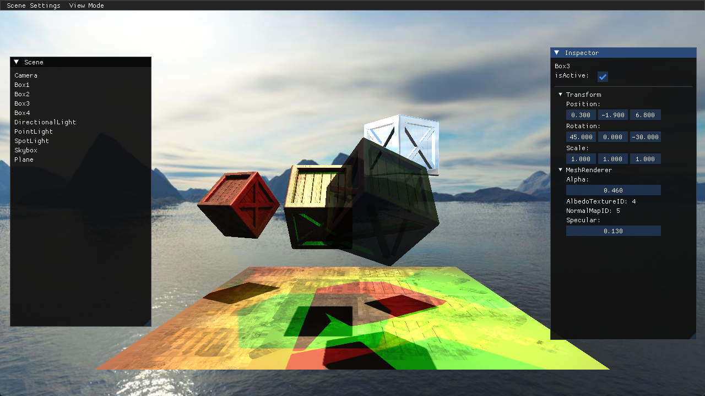

# ZaxEngine

该项目的目标，从渲染出发，逐步构建出完整的游戏引擎。

引擎名取自FF7中的角色扎克斯，象征着荣誉与梦想。

关于每个版本的变化情况，查看 Versions 目录，为了方便后续的查看，[Versions目录](./Versions)会包含所有版本信息。

主要的开发进度放在 dev 分支，稳定或者版本归纳会合并至 master

由于这不是个扫盲文档，所以每个版本信息，基本上是一个知识点的梳理，深入的内容，需要自行浏览代码以及查阅其他相关资料。 
如果后期发现前面版本的文档有错误，只会在最新的提交上去修改版本内容。

此文档只记录核心内容。
目前工作任务繁忙，开发进度缓慢，但是会持续开发。

**如何运行：**
1. 打开 Source/ZaxEngine.sln，生成引擎项目
2. 打开 Project/Default/Default.sln，生成项目
3. 在ZaxEngine.sln运行或者运行Source/Binary/Debug/ZaxEngine.exe

**已完成功能：**
* 基本场景显示
* 基本前向着色,材质为 Blinn-Phong，法线贴图，透明材质,光源基础阴影(三类光源阴影，以及depthbias和pcf)
* 自定义Shader格式，实现变体(Keywords)功能
* C#脚本层接入，通过C#实现场景的加载，以及自定义组件

**后续功能：**
* 简易资源管理
* 碰撞与物理
* 音频功能
* PBR材质
* 延迟着色
* 编辑器优化：SceneView 与 GameView 分离
* 阴影优化：比如 点光源根据每个面的VP精确的计算，Normal Bias,CSM,PCSS,PCF的Bias优化(Receiver Plane Depth Bias), 等等
* 更多功能后续逐步填充

**引擎引入的第三方插件和库：**
* imgui v1.90，配置过程参考示例中的 example_glfw_opengl3，glfw 是一个多平台窗口管理器，同时因为项目初始使用 OpenGL API，所以此界面插件也采用此图形库。
* glad2 v2.0.4，用于运行时查找 opengl 函数。github 需要选择 glad2 分支。库要在网站生成，选项选择 gl 3.3，勾选 loader。注意是 glad2 而不是旧版的 glad
* stb_image，图片加载库
* glm，数学库
* assimp v5.3.1, 资源模型导入库，比如 obj，fbx
* boost，v1.86.0，基础能力，比如 filesystem,json
* unity mono, branch 是 unity-2022.3-mbe, 提供C#脚本能力

参考引擎：Overload,Godot,Unity,Unreal

图形 Debug 工具：RenderDoc

引擎编译工具：VS2022，这里没有选择CMake，目前主要开发还是在PC平台，到后期如果有跨平台需要再进行切换。

C++版本：C++17

初始版本使用 OpenGL 图形库,版本为 3.3（此版本可以包含大部分内容了，如果后面功能不足，会进行版本升级），后续随着扩展，会逐步扩充 DirectX11，DirectX12，Vulkan，当然，这是当前版本稳定后的事情了。

坐标系当前采用右手坐标系，屏幕为xy方向，垂直面向你的方向为正z方向。z向与Unity坐标相反。有些文章说 OpenGL 是右手坐标系，这是不对的，只是旧的固定管线为右手，而现代管线是自己来定的。这里采用右手坐标系，因为glm库的默认以右手坐标系来生成矩阵的。

当前版本的画面：

