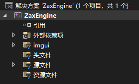
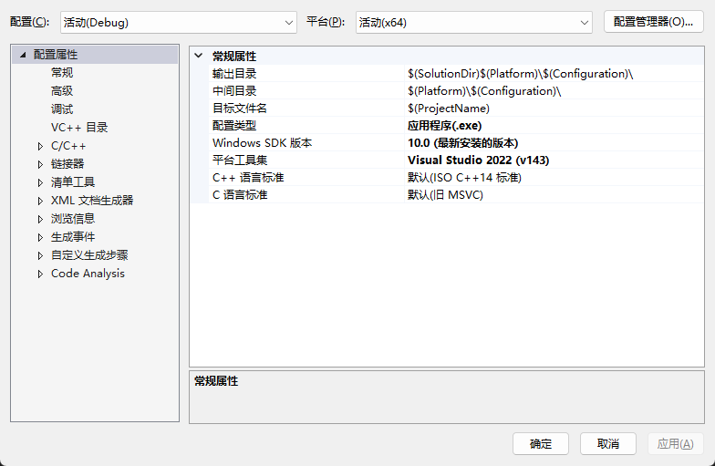

接入 ImGui 过程比较简单，该库自带了 example，example_glfw_opengl3，按照这个示例进行配置即可。

问题集中在 VS 的配置上。

**1.VS目录**

* 引用，
* 外部依赖项
* 蓝色筛选器

**2.VS项目属性配置**

* C/C++ -> 常规 -> 附加包含目录，配置 imgui 等头文件目录
* 链接器 -> 常规 -> 附加库目录，配置依赖库的目录位置
* 链接器 -> 常规 -> 附加依赖库，配置具体的依赖库, 上面仅仅指定目录是不够的，这里要把具体依赖的库准确的进行配置，目前只需要 opengl32.lib,glfw3.lib

属性配置主页面左侧，可以看到一个单独VC++目录，对初学者比较困扰。C++作为一个可跨平台的语言，目录分为两种，系统目录和项目目录。VC++目录配置的就是系统目录，比如 #include<> 就是访问的系统目录，这个属性目前来说不需要修改，使用默认配置即可。

还有1个额外注意项，要将 链接器->系统->子系统 修改为窗口，代码中的 main 改为 wWinMain，这样就不会出现控制台，只出现窗口了。

**运行结果：**

