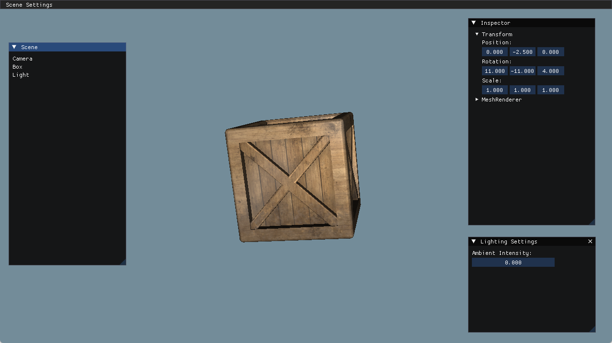

## 多光源计算

主要内容：
1. 点光源 PointLight
2. 聚光灯 SpotLight
3. 由于没有阴影，导致遮罩的地方依然带着亮度，这部分阴影计算，后面补充

这部分内容还好，主要是光源的衰减计算

一般衰减策略，常数衰减，线性衰减，指数衰减，二次方衰减等

点光源，根据距离衰减，在当前版本，先临时用线性衰减。在 LearnOpenGL 文章中，使用了一元二次方的衰减，，由于存在两个系数，这个系数根据经验值得出的，这可以找表对一下(LearnOpenGL中有)。

聚光灯，距离衰减和边缘衰减，对于边缘衰减，又分为内外区域，只有外区域衰减。 
对于距离衰减，我们依然可以采用跟点光源一样的方式。 
对于边缘衰减，这里也是采用线性衰减。

对于边缘衰减的线性方程，我们可以这样推导，衰减方程为 y = Ax + B, 假设内锥角度为I度，外锥角度为O度，当为x为I度时，y为1，当x为O时，y=0，带入方程可得 y = (x-O)/(I-O)，然后把 I 和 O 换成余弦，就成了 y = (x-cosO)/(cosI-cosO)，其中，x 也是余弦。不然一上来就给你个cos方程，谁能知道是什么关系。 
为什么要换成余弦呢？是因为如果你用角度，那么 x 就是角度值，而求两个向量的角度值，需要反余弦或者反切函数，三角函数在计算机中的运算有好几种方式，以泰勒级数展开为例，非常消耗性能，所以直接用向量点乘求出的余弦，而不是角度的余弦。 
这也是个启发，能不求角度，就不求。

经过我的一些发现，这个衰减在不同的引擎上，也有不同的做法。

**这里需要强调一点，这里所提到的衰减计算，都是经验上的，并不是直接基于物理的，等到了PBR渲染时，我们会接触到PBR下的衰减公式**

**运行结果：**

