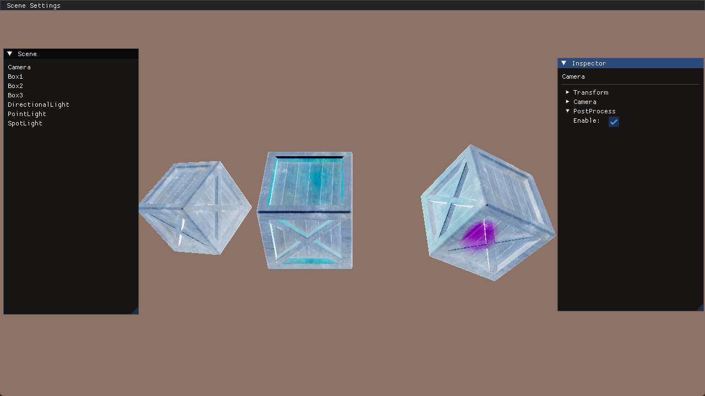

## FrameBuffer帧缓冲 与 后处理

主要内容：
1. 创建自己的 Vector 和 Color 结构
2. 使用帧缓冲，简单的后处理

对于第1点，特别注意的是，IMGUI操作的是 float*，所以，需要把 Vector 和 Color 进行强转。为什么可以强转，因为C++中两者只要内存布局是一致的，那么 float* 和 其他类型就没什么区别，只是个内存的起始地址而已。

本来这一版本，想要做阴影的，但是阴影问题会牵扯到帧缓冲与立方体贴图，所以，这里先把帧缓冲熟悉下。

帧缓冲，就是渲染流水线最后保留下的数据，比如屏幕颜色，深度值，模板值。如果在渲染时，设置的缓冲是屏幕关联的帧缓冲，那么就会渲染到屏幕上，如果此缓冲不与屏幕关联，就是所谓的离屏渲染。

对于颜色值，使用纹理对象保存，而对于深度值和模板值，因为当前只需要写操作，所以直接使用渲染缓冲对象(Render Buffer Object)。

这个 RBO 也没什么特别的，就是一个原生的内存区域，不像纹理对象，有各种属性(比如Wrap/Filter)，它只是单纯的包含数据。

**也就是说，帧缓冲并不直接包含实际数据，是空的，而是通过关联这种纹理对象/渲染对象等缓冲对象，来间接保存数据。能够理解这点基本就差不多了。**

整个过程大致如下：
1. 生成FrameBuffer，并绑定纹理和渲染对象
2. 设置当前渲染的FrameBuffer，并执行渲染过程
3. 设置当前渲染的FrameBuffer为窗口的 FrameBuffer，只要绑定ID为0即可，然后对上述的 FrameBuffer 中关联的纹理执行后处理操作。

增加了几个类：
* FrameBuffer 类，封装 FrameBuffer，以方便FrameBuffer的创建
* PostProcess 组件，挂在 Camera 下，同时可以设置组件 enable 来关闭后处理
* Application 类，用于记录全局信息
* Mesh 和 QuadMesh，提供一个四边形的Mesh，以及绘制绑定

### 需要注意的点

当窗口尺寸变化时，需要重新设置FrameBuffer关联的纹理和渲染对象的大小。

为了实现多次连续后处理，如果用过 Unity 就清楚，需要两个 FrameBuffer，交换渲染，这样才能保留前一个后处理的效果。那么，现在已经有了一个渲染场景的 FrameBuffer，所以为了连续后处理，还需要额外的 FrameBuffer。

当绑定 FrameBuffer 的 ID 为0时，并没有关联任何帧缓冲，此时相当于一个指令，表示当前渲染的目标为窗口的缓冲。所以通过 glGetFramebufferAttachmentParameteriv 函数，并不能获取到 ID 为 0 的帧缓冲信息，因为0这个ID是特殊的存在，并不关联帧缓冲。(在DirectX11中，BackBuffer是显示单独绑定1个帧缓冲的)

在进行 SwapChain 的过程中，根据大多数文章所言，是直接交换两个缓冲的地址，以达到 Back 和 Front 的切换。

**运行结果：**

