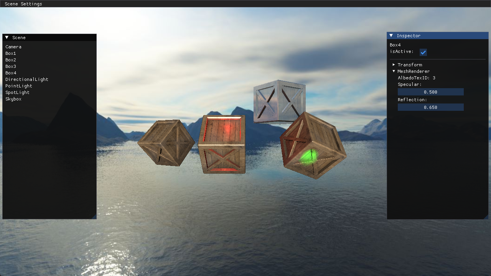

## 天空盒、反射与环境映射

主要内容：
1. 使用立方体贴图创建天空盒
2. 给于材质以反射贴图，来表示对环境的映射

### 立方体贴图与天空盒

关于天空盒，需要了解以下内容：
* 立方体贴图的大体制作过程，这样你才能了解为何使用方向来采样纹理
* 环绕方式为 Clamp Edge，这样才能防止出现接缝
* 虽然采用使用方向向量，由于立方体的中心点为0，所以其实方向向量就等价于片元的位置
* 通过禁用深度写入，来控制天空盒永远在物体后面

很对资料一上来就说，要怎么怎么采样这个立方体贴图，但是都不提为什么。 
这里涉及到贴图的制作过程，是将周边环境，映射到立方体表面的过程。想象一下，从一个点出发，朝向周围发射射线，射线会同时与立方体和环境相交，然后将相交的环境颜色值，写入到立方体中，整个过程大体是这样子。 
那么，这里还会涉及到间隔多少度去采样，更小的间隔会使得图像更加还原。无论是映射到立方体(天空盒)，还是球体(天空球)，基本思想都是一致的。如果想更加了解这个过程，还需要亲自实现采样过程。这里了解就可以了。

**为什么立方体贴图，采样时可能会出现接缝** 

这里涉及到纹理过滤和纹理环绕的关系。当我们纹理过滤选择Linear时，那么，此时纹理进行纹理采样，跟周边的像素是相关的，然后，如果环绕方式设置为 Repeat，同时采样一张纹理的右侧边缘，那么，所有右侧边缘的颜色值，实际上包含了纹理的最左侧的颜色。 
当两个纹理都是同样的设置，如果我们去采样到两个纹理的中间，这个时候，会出现两个问题：
1. 假设都采样到了其中一个面，那么由于 Repeat 的关系，这个颜色值，并不能像我们想象的那样，左右可以连接，因为颜色值本身是 Linear 过滤后插值的。
2. 由于 GPU 的浮点精度问题，还会导致有时候采样了左边的面，有时候采样了右边的面，这时就使得了两个面的接缝问题更加明显。

这两个问题的叠加，导致了当过滤选择 Linear，环绕选择 Repeat 时，会出现接缝问题。

解决方案，就是采样 Clamp Edge 环绕，这样对于第1个问题，由于两个面接缝处的颜色值基本是相似的，所以颜色差会非常小，基本可以忽略。对于第2个问题，虽然还是存在，但是因为接缝处的颜色相近，那么，也是可以忽略的。

**注意，接缝问题还是会存在的，并没有消失，比如你将摄像机视角设为45度，那么，你还是能看到接缝的，但是，如果是90度，基本上看不到了。这也是球形天空的优势之一**

这个问题其实蛮有意思的，可以让你认识到，纹理过滤和纹理环绕的关系性。

**一些小的细节**

1.为什么加载纹理时，不需要反转了，因为 CubeMap 读取时，据说沿用了 RenderMan 的约定，即传送 cubemap 的 face 的时候，data 的起始位置应该是图片的左上角像素，所以，对于 cubemap 的纹理，并不需要上下反转。

2.裁剪出的单张纹理，注意2个问题，第1，所有纹理左右是反向的，因为纹理是贴在立方体外面，而相机是要看立方体的里面，所以单张纹理其实是反向的，第2，前后的纹理，是交换的，也就是，裁剪之后，前纹理front需要是背面，因为我们使用的坐标系，z 轴的正值是背面。当然，也可以前后纹理是正常的，然后直接在 shader 中，将 z 反向

3.立方体不需要模型矩阵，所以你调节 transform 值，是不起作用的。

4.关于深度测试问题，首先，我们想要让立方体有最大的深度，所以，我们返回的 gl_Position 的 z 和 w 应该是相等的，这样经过透视除法，最终的深度值会为1，其次，深度测试函数，需要修改为小于等于，而不是小于，如果是 GL_LESS，会出现背景和天空盒存在 z-fighting，出现闪烁问题，这是因为 opengl 默认会将深度缓冲重置为1，这样背景和天空盒的深度值就一样，那么会出现闪烁问题。

### 反射与环境映射

虽然也可以实现折射环境的材质，但是我觉得目前来讲折射还不太合适，因为折射毕竟有折射率，并且要有厚度处理，在光栅化渲染的情况下，这个可能需要更多的处理，所以当前章节暂时不做折射材质，以后再考虑。

反射贴图(Reflection Map) 原理也不难，由于没有合适的模型，这里也不去做了。

这里只简单的，利用一个箱子，显示环境内容。

**运行结果：**

