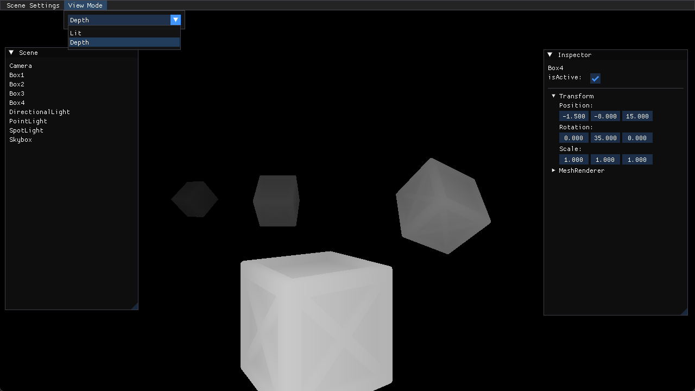
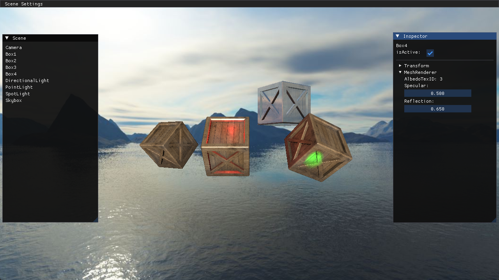

## 阴影 ShadowMap

主要内容：
1. 深度可视化
2. 显示直射光阴影
2. 显示点光源阴影

因为阴影需要深度信息，所以，先将深度可视化，作为预备知识，为显示阴影做准备

### 深度可视化

在片元着色器中，从 gl_FragCoord.z 获取深度值。
```c
FragColor = vec4(vec3(1-pow(gl_FragCoord.z, 200)), 1.0);
```
首先通过 pow 函数，放大深度差，然后因为越靠近摄像机的深度越小，这样显示出来从近及远是黑色的，所以通过 1-x，进行反相，这样结果就是从近及远，由白变黑。

gl_FragCoord，xy 表示该片元屏幕窗口的位置，默认左下角为(0,0)。z表示深度值，范围为0-1，与右手坐标系不同，而是z朝前越大，属于左手坐标系。

我们知道，在顶点着色器中，返回的是一个边长为2的立方体空间，而坐标范围为(-1,1)，所以，在经过视口变换后，得到的屏幕坐标的z值，会被映射到(0,1)，这是个值得注意的点。

在投影矩阵中，有1件事没有说明，便是z轴的非线性变化，因为我们需要靠近摄像机的物体，精度更大，所以进行了非线性变换，这个可以看其他文章。

还有1个内置变量容易混淆，**gl_FragDepth**，这个表示可写入深度值，也即深度测试会使用的值，gl_FragCoord.z 跟这个的关系，如果没有特殊情况修改过gl_FragDepth值，gl_FragDepth 就会默认使用 gl_FragCoord.z，当然，这也是在片元处理之后了，如果在片元中对 gl_FragDepth 读取的话是结果总是0.



### 直射光阴影


### 点光源阴影


**运行结果：**

