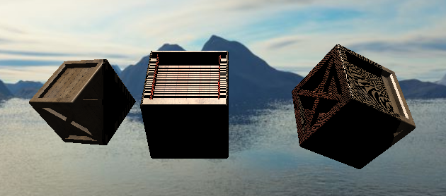
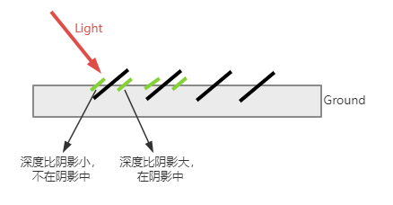
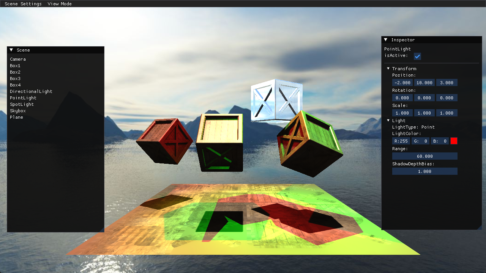

## 阴影 ShadowMap

主要内容：
1. 深度可视化
2. 平行光阴影
3. 聚光灯阴影  
4. 点光源阴影

因为阴影需要深度信息，所以，先将深度可视化，作为预备知识，为显示阴影做准备

### 深度可视化

在片元着色器中，从 gl_FragCoord.z 获取深度值。
```c
FragColor = vec4(vec3(1-pow(gl_FragCoord.z, 200)), 1.0);
```
首先通过 pow 函数，放大深度差，然后因为越靠近摄像机的深度越小，这样显示出来从近及远是黑色的，所以通过 1-x，进行反相，这样结果就是从近及远，由白变黑。

gl_FragCoord，xy 表示该片元屏幕窗口的位置，默认左下角为(0,0)。z表示深度值，范围为0-1，与右手坐标系不同，而是z朝前越大，属于左手坐标系。

我们知道，在顶点着色器中，返回的是一个边长为2的立方体空间，而坐标范围为(-1,1)，所以，在经过视口变换后，得到的屏幕坐标的z值，会被映射到(0,1)，这是个值得注意的点。

在投影矩阵中，有一件事没有说明，便是z轴的非线性变化，因为我们需要靠近摄像机的物体，精度更大，所以进行了非线性变换，这个可以看其他文章。

还有1个内置变量容易混淆，**gl_FragDepth**，这个表示可写入深度值，也即深度测试会使用的值，gl_FragCoord.z 跟这个的关系，如果没有特殊情况修改过gl_FragDepth值，gl_FragDepth 就会默认使用 gl_FragCoord.z，当然，这也是在片元处理之后了，如果在片元中对 gl_FragDepth 读取的话是结果总是0.


### 直射光阴影

这部分核心有4个问题：
1. 坐标计算，主要是光栅化的前过程：裁剪、透视除法和视口变换
2. 阴影失真，这个是稍微难理解点
3. 阴影锯齿

阴影技术也称为ShadowMap，实现的基本思路比较简单，就是先从光源的视角，渲染一张深度图，然后在正式渲染场景时，将片元变换到光源的视角下，如果此片元深度值大，说明这个片元在阴影中。

思考一下，可不可以先渲染场景，再渲染光源深度图呢？可以这样，但是，这样的话，你就得到了一个已经着色后的片元，这样你的处理方式就非常受限制(只能是在阴影中和不在两种情况)，是不如先渲染深度图灵活的。

在绘制ViewMode的深度图时，我们的帧缓冲，同时开启了颜色绘制和深度填充，这是为了对深度值做简单的显示处理。<br>
但在绘制阴影时，我们不需要做额外处理，所以要关闭 ShadowFrameBuffer 的颜色绘制，并将 Depth 绑定一个纹理，而不是RB，这样直接将深度值填充到纹理中。之前有个版本，我们说过帧缓冲必须要绑定颜色缓冲，在这里就不对了，其实是可以关闭的。那么，这个纹理就会只有 r 值会被写入深度值，所以读取时，只读取 r 值就可以了。（为什么Untiy还需要将深度值编码为RGBA呢？因为旧的API并支持深度纹理格式）

当使用平行光去阴影投射时，那么，需要从光源的角度构建 View 矩阵，这时光源的位置，作为一个平行光，正常来讲是不影响光照的，但是，这里，由于构建View以及正射投影矩阵，所以会影响到阴影，比如某个物体，可能在光源的后面，所以，实际生成矩阵时，我们不能采用光源的位置，而是根据整个场景去调整生成矩阵的这些参数。<br>
这部分内容，目前整个引擎框架还未搭建完成，所以暂时先放一下，先用 light 位置代替。

在解决阴影失真的过程中，自己犯了2个很严重的错误，导致了浪费了大量时间
1. 在光视图的投影矩阵上，正射投影的大小，我最开始为了能够覆盖全场景，所以刻意设置了一个100单位的正方形大小，那么，导致的结果就是，同样的阴影图分辨率1024，如果是10单位，那么每个单位是100个像素，但是如果是100单位，每单位只有10像素，所以搞了两天，用了可尝试的方法，失真问题还是存在。<br>
在想到是大小设置的问题前，我确实没有想到正射投影的大小会如此影响阴影图，认为是越大越好。（问题的发现是不断地修改参数，然后又对比Untiy的阴影图，发现Untiy的阴影图很紧凑）
2. 在构造正交投影矩阵时，将top和bottom的正负写反了，真是蠢哭了，导致了无论怎么调，都达不到效果，后来从 renderdoc 的深度图里找到点蛛丝马迹，发现深度图渲染错误，最后发现是参数写错了，这里几乎也浪费了快两天，不过因为这个，我也好好的了解了更多阴影相关的知识点。


**坐标计算**

因为变量 fragPosInLight 并没有经过内部的光栅化前过程(裁剪、透视除法、视口变换)，所以这里需要自己计算。不过可以先进行除法和变换，再进行裁剪。(流程跟硬件层是不太一样的，因为我们不是要进行真正的裁剪，只是为了判断)

透视除法和视口变换的代码：

```c
vec3 fragScreenCoordInLight = (fragPosInLight.xyz / fragPosInLight.w).xyz * 0.5 + vec3(0.5);
```

进行了透视除法和视口变换，但有2个注意点：
* 第1点，我们仅把坐标映射到0-1而不用真的映射到屏幕分辨率，因为0-1是为了我们可以直接从 ShadowMap中采样，纹理的坐标范围是0-1
* 第2点，驱动的视口变换，会进行坐标系转换，但是我们并不需要，所以相比驱动的变换，我们少了这几个步骤，这个是需要了解的。


对于裁剪，产生的问题时，当场景很大时，如果场景受光的部分远大于光的阴影范围(就是投影矩阵窗口的大小和远近)，那么对于那些部分，当采样深度图时，会出现问题。所以需要做2个事情：
1. 把深度图的环绕方式改为 Clamp，并将深度图的 Border 设为1，这样如果横向超过范围，采样的深度就是1，表示阴影为0
2. 如果判断的顶点超过了光视图的最远处，那么，z 会大于1 (因为这个坐标没经过光视图下光栅化的裁剪过程)，所以当 z 大于 1 时，也要限制阴影为0

**阴影失真(Shadow Acne)**

如果只进行上面的处理，那么，你可能会得到下面的结果：


图中平行光的朝向为朝前，同时箱子存在一定斜率，可以看到条纹现象。（上面的图片我通过其他光源加强了一下亮暗对比）

其失真的原理，主要在于深度图的分辨率，以及采样是离散采样:


绿色粗线表示需要渲染的片元在光视图下的位置，黑色粗线表示周围片元对应深度图的位置，假设有2个片元都去找同一个位置，那么很可能出现其中一个深度比该位置的深度小，另一个大的情况。

那么解决方案，最直观的方式，就是添加一个偏移，将所有片元在光视角下的深度，再减小一个偏移值，比如 0.005，这样就强行的将片元的深度值变小。

那么，根据图示，可以知道，不同的倾斜角，有不同的偏移值，具体要添加多大的偏移呢？要解决阴影失真，必须要理解 shadow bias 数值的精确计算方法，其实不难，就是一丢丢三角函数关系。[具体计算可以查看这篇文章](https://zhuanlan.zhihu.com/p/370951892)。

对于偏移的方案，有2个方案：
* Depth Bias，也称为 Slope-Scale Depth Bias，沿光线方向偏移
* Normal Bias，沿法线方向偏移

很多文章会单独说 Slope-Scale 的概念，实际上，现在的偏移都是 slope 相关的了，固定偏移在真实场景中，没有实践价值。

这两种偏移方式，都存在一定的问题，但是可以结合两者，去做一个比较平衡的效果(Unity中结合使用两种方案)。这个版本暂时只用 Depth Bias。

顺便提一下，只要是偏移，那么不免就会存在悬浮或者透光的情况，无论哪种方式。其中一种解决悬浮的方式，就是 **绘制阴影图时，使用正面剔除**，那么深度图里保存的，就是背面深度，对于闭合的物体来讲，在渲染场景的阶段，正面的顶点深度一定是远小于背面的，所以就算在有偏移的情况下，也不会出现悬浮了。<br>
但是采用正面剔除后，就会导致薄物体不写入深度，那么就不会记录到深度图，这样问题会非常严重，当下的主流引擎，也都没有采用这种方式。因为大部分情况下，设置一个偏移，已经完全满足需求了。

**注意,在LearnOpenGL的评论里，有人说到正面剔除和偏移是都是都是解决失真的方式，这是理解方式的不同，因为如果只用正面剔除，那么，在某些角度下条纹现象还是会特别明显。所以，我理解上，正面剔除只是作为辅助存在的**

最终计算，我采用了直接的几何运算，而不是 cos 拟合做法，因为 cos 拟合的问题在于，这个拟合针对的是屏幕映射之后的深度值，而不是View矩阵计算后的深度值，这样会导致，不同的 Near 和 Far，拟合的结果并不好，尤其是聚光灯，或者说，并不适合现阶段的效果。现阶段，我们就是想要一个精确的bias计算。
```glsl
    float a = frustumSize / shadowSize * 0.5;
    float b = length(cross(normal, lightDir)) / dot(normal, lightDir); // tan 转化为 sin/cos，便于计算
    float bias = max(light.depthBias * a * b, 0.1); // 限制最小值，depthBias 为可调节值，为什么要限制最小值，假设光方向和法线方向在0-1度左右之间时，如果不限制最小值，由于 bias 计算结果太小，还是会出现条纹。
```


### 聚光灯阴影

主要解决3个问题：
1. 投影为透视投影下的深度比较
2. 处理如何去混合多光源阴影
3. Depth Bias 在透视投影下的计算

**关于深度比较**

如果使用透视深度进行比较，那么，聚光灯距离物体太远时，偏差计算会使阴影消失，因为本来进行偏差的几何推导时，我们采用的是线性计算，而透视是非线性的，并且深度值大都靠近1（通过renderdoc，可以看出只有将范围缩小到0.9-1时，才能看出深度轮廓），所以，在对比时，需要将两者的深度，计算为线性深度再对比。

转换公式为：
```glsl
fragDepth =  (2.0 * light.near * light.far) / (light.far + light.near - fragNDCInLight.z * (light.far - light.near));    
```

这个就是对透视投影z值的逆运算，但是，你推导之后，会发现上面的公式，是逆运算后，又加了个负号。还记得右手坐标系下，Z轴正值的朝向吗？添加负号后，就表示结果是个正的深度值，而不是负值。

还需注意，这个公式里面的 z 是 NDC 坐标。

**阴影混合问题**

在多光源情况下，每个光源，都会有一张深度图，那么，问题来了，如果还是像之前那样，把所有的光照计算，都放在一次DrawCall下，会出现什么情况？这是不可能完成的任务!因为纹理单元是有限的，但是，我们的阴影数量，可以是超过8张，甚至更多，API或者硬件层面是无法同时处理如此多的纹理单元的。同时，每个灯光都有自己的光视图矩阵，这个也是没法处理的，至少目前来讲<br>

通过Unity的Standar管线渲染Pass结构，可以得出一个解决方案，就是每盏灯光的着色，都执行一个DrawCall，而这次DrawCall，只去处理该光源和传输该光源的阴影贴图。这也解答了我之前的疑惑，就是为什么本来可以直接在一个DrawCall完成的光照着色，要分成这么多DrawCall，阴影应该也是其中的一个原因。

那当前的方案就是，将每个光照的着色分开，每个灯光单独一个阴影图和DrawCall。

这里实现上的细节：
1. 混合与深度测试，每个灯光计算结束，通过混合加起来，但是，在绘制平行光时，需要混合光闭，同时深度测试为LESS，其他光源，混合开启，同时深度测试为LESS EQUEL，这样才能在其他光源绘制相同深度的时候，不会丢弃片元。假设第一遍渲染时就开启，绘制物体时，可能会先绘制后面，再绘制前面时，会跟后面已经渲染的片元进行混合，这是错误的结果。


**Depth Bias 在透视投影下的计算**

主要考虑2方面的问题：
1. 根据片元与灯光距离的不同，像素大小是不同的，也即 Frustum 的大小是不一样的。这个可以根据椎体的几何结构去计算出当前片元所在平面的 Frustum 大小
2. 透视投影下的偏移的几何计算，其实跟平行投影是一样的。这里我之前一直没弄清楚，导致试了很多错误的几何计算，浪费了很多时间。虽然说是聚光，但是线性深度值还是一个light view空间下的Z轴，不是透视空间，也并不依赖点到光的距离和方向。

对于第1点，为什么都是从同一张纹理去采样，而像素大小是不同的。虽然都是从同一纹理采样，但是，当近处物体的片元采样时，实际上是比较的该片元所在的 Frustum 平面，相当于把最远处的远平面缩放了。

目前，在大概 100 单位的 Range 内，不会出现条纹现象，但是，如果 Range 太大，还是会出现或多或少的条纹，目前还没找到原因。


### 阴影锯齿以及当使用Bias的情况下PCF出现的问题**

这里使用1种基础的抗锯齿方案：PCF，类似于 MSAA

PCF(percentage-closer filtering)，术语看起来比较高级，实际上就是个n*n的采样平均效果，这个很好理解。目前版本采用 3*3 采样。

这个版本，由于使用了Bias，如果使用通常的PCF计算，那么，在与光角度相对较大的情况下，又会出现条形纹路的失真现象，这是因为，当采样周边坐标的深度时，Bias大小并不是正确的，因为这个Bias只针对当前坐标。

很多文章说明了这一点。

目前解决这个问题，有2个方案：
1. bias cone，要采样的每个样本朝着光线移动的比例与其与原始样本的距离成正比
2. receiver plane depth bias，接收器平面深度偏移

目前来讲，第2种方案应该是目前的主流方案，效果也更好，但是，由于进度问题，先采纳第一种方案，实现起来比较简单。效果总体来讲还可以，只是在法线与光的夹角比较大的时候，阴影边缘会出现明暗的小分层。


### 点光源阴影

主要内容：
* 透视矩阵，且视角为 90度，深度调整为距离光源的深度值
* 立方体深度贴图的阴影的绘制和使用
* Bias 和 PCF 的注意问题

在LearnOpenGL中，采用了几何着色器绘制阴影，但是，在当前阶段，还是使用普通方式，通过渲染六个面，构成立方体贴图

之前的天空盒已经使用过立方体贴图了，这里会对立方体贴图有一个更清晰的了解，因为需要自己生成立方体贴图中的Shadow内容。

这里再重申一遍立方体纹理的采样原理：CubeMap使用三维纹理坐标采样。首先选择标量正值最大的那个分量作为采样的面。例如(−3.2,5.1,−8.4)就选-Z面进行采样，剩下的那两个分量就除以标量正值最大的那个分量，以便映射到[-1,1]区间。之后再将这些值映射到[0,1]区间。

这里编码时，留意的问题有：
1. 如何渲染立方体贴图的1个面，通过多次渲染，传递不同面的 texture
2. 六个方向的视图矩阵如何构造，还记得天空盒说过的坐标问题吗，立方体的每个面中，像素坐标要从左上角为原点，但是，对于上下面，不那么好理解，因为从哪个方向看，像素坐标的原点都可以是左上角。这里通过测试得出，当你面向Z轴时，那个左上角才是纹理原点。这里有个必要性技巧，就是将渲染出的深度图，通过天空盒的方式渲染到场景中，可以很容易看出深度图的问题。
3. 一个 Shader 下，无法通过条件判断去采样立方体阴影贴图，所以，不同的光源，需要不同的 Shader

另外，还有一个显示cubemap深度图的技巧，通过显示 shadowdepth，可以确切的看到深度比较，这样能更清晰的看到深度的对比效果。

关于第三点，为了重用 Shader 代码，希望能够实现 ShaderLab 中的 Keyword 功能，这样，根据不同的 Keyword，使用不同的代码，并且保持更好的代码重用。这部分在下面有更多的阐述。

对于 Bias，由于深度值采用的是距离光源长度为深度值，并且，没有将6个VP矩阵传输到Shader中，所以，是无法做到坡度相关的Bias的，只能采用固定Bias。（在URP中，是通过传输6个面的视图矩阵，以实现坡度Bias，其实就类似于SpotLight了）

PCF，有2个注意问题：
1. 原来是两个轴采样，立方体阴影需要采样三个轴，但是，这里可以有个优化技巧，通过自定义的数组取代三个For循环，这样好处就是可以控制采样数量，保证性能在可控范围内。
2. 对于点光和聚光，可以获取到每个像素的大小来设置每次的偏移量。但是对于当前的距离深度图，你是做不到的，只能也是一个固定值。

对于 Bias 和 PCF 的这两个问题，只有在着色器中算出当前在哪个面，同时Shader中又包含了这个面的信息的情况，才能更准确的描述。但是由于当前的开发时间关系，暂时搁置，等后期补充。


### 自定义 Shader，以实现 Keyword 功能

ShaderLab 的 Tags 和 Keywords，通过 Tag 决定此 Pass 是在管线的哪个位置，Keyword 等同于 #Define，不同的 Keyword 会产生不同的 Shader。

这里其实就是需要 Keyword 功能，但是我们就采用简单方式处理，材质通过字典来绑定多个 Shader，勉强表现 Keyword 特性。所以，这里就要对材质代码进行不小的修改。

Keyword 可以任意组合，生成新的 Shader。关于 Keyword 的组合，当前使用节点树写组合算法，最后通过结点遍历，将所有组合存储起来。

在 ShaderLab 中，VS 和 FS 是放在一起的，keyword 也是共用的，这样是比较符合常理的。所以，这里也需要分析完两个Shader，归纳出所有的 keyword 才可以。

基本格式如下：

```glsl
#version 330 core

//KEYWORD:Test  
//这里会被替换为 #define Test

void main()
{}
```

那么，将会生成2个 Shader，带有 Test 和 不带的。


**运行结果：**
