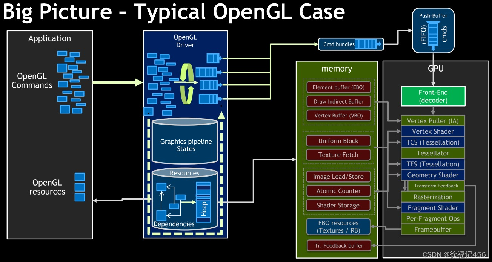
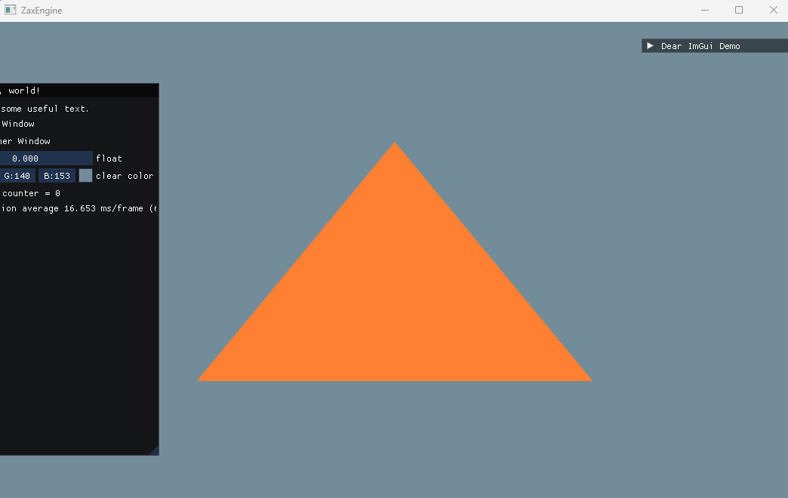

以绘制三角形为例，来熟悉 OpenGL API。

主要参考：[LearnOpenGL - 你好，三角形](https://learnopengl-cn.github.io/01%20Getting%20started/04%20Hello%20Triangle/)

这部分内容，对于刚接触 OpenGL 来讲，有难度的。这里同时也对参考文章里的一些内容进行了扩充。

主要知识点：

* glad 库的接入
* 硬件层渲染管线
* 缓存对象：VBO、EBO/IBO、VAO
* 着色器程序、顶点着色器、片元着色器

### GLAD 库的使用

引入 glad 主要是因为 OpenGL 驱动版本很多，大多数函数的位置都无法在编译时确定下来，所以需要在运行时查询。

GLAD就是一个库，能在运行时查找OpenGL的函数地址，这个找到的函数地址用一个函数指针存起来，供我们使用。因此我们所说的OpenGL API，在这种情况下，就是GLAD用函数指针封装好了的。简单来说，就是我们想要用OpenGL，就需要通过GLAD来从显卡驱动中取出函数来给我们用

下载 glad 时需要提供 opengl 的版本，当前使用 3.3，相应的 glsl 版本为 330

引入会导致一些与 ImGui 的冲突，因为 ImGui 中也包含了这样的操作。这点可以参考 [SheeEngine(8) —— GLAD 和 IMGUI - 知乎 - Hier.soan](https://zhuanlan.zhihu.com/p/549861908)

**解决方案就是将在项目的预处理器中加上 GLFW_INCLUDE_NONE**

还有注意 include目录以及在main中初始化 glad

### OpenGL渲染管线


### OpenGL 渲染架构

OpenGL架构分为三层：应用层、驱动层、GPU层。
<br>OpenGL命令从应用层经过驱动层，再到GPU层处理；
<br>OpenGL资源从应用层经过驱动层(由图像管线状态机管理)，再到GPU层的内存



<br>

### 缓冲对象以及相关函数

一个缓冲对象要经过3步处理，以顶点缓冲对象为例：
```c++
unsigned int VBO;
glGenBuffer(1,&VBO);
glBindBuffer(GL_ARRAY_BUFFER,VBO)；
glBufferData(GL_ARRAY_BUFFER, sizeof(vertices), vertices, GL_STATIC_DRAW);
```

glGenBuffers(GLsizei n,GLuint * buffers), 表示生成一个缓冲对象，此时只是个 Handle，可以理解为空对象

glBindBuffer(GLenum target,GLuint buffer)，第一个参数是缓冲区类型，表示后续所有对于 target 的操作，都是针对这个对象的，比如例子中的 VBO，此时只是设置了 OpenGL 的状态，还是没有内存操作的。这个 target 需要特别了解以下，每种数据会对应不同的 target。

glBufferData(GLenum target, GLsizeiptr size, const void *data, GLenum usage)，在显存里申请一块内存，并使用内存中的data数据去初始化该显存，也就是拷贝了一份。

对于 glBufferData 可能存在的疑问：
* glBufferData 这种内存操作是异步的吗？这牵扯到同步及缓冲问题，可以看下面一节。

**VAO**：虽然全称为顶点数组缓冲，但是实际功能是用来记录顶点属性配置和缓冲的绑定(包括顶点和索引缓冲)，这样就不用重复的配置顶点属性和绑定了。


### OpenGL 的同步与双缓冲

作为三层结构的架构，为了让开发者在使用时感觉是同步的，那么，就需要各种命令和内存的缓冲。

OpenGL的客户端服务端模式，客户端就是我们的应用层，服务端就是OpenGL驱动层和GPU硬件层。

<br>因为这个模式的存在，就导致开发者调用函数后，可以理解向驱动层发送指令，驱动层和GPU都有自己的命令缓存，在执行这些指令时有它自己的执行逻辑，这对于开发者是隐藏的。这个就涉及了同步的概念。那么先提一下，感兴趣的可以自己找找文章。

举例来说，glBufferData 函数用于在显存上申请内存，但实际上，OpenGL驱动会首先在主内存申请一块内存，将数据拷贝到主内存上，然后在合适的时机，才会通过 DMA 进行异步传输到 GPU 的显存上。

那么，这就会出现一种问题，如果在传输过程中，又对这个Buffer写入数据，结果是什么呢？
<br>结论是，CPU还是会阻塞，直到DMA把顶点buffer中的数据传输完毕后，才允许我们继续向里面写数据。即便是有DMA异步传输，碰到不良的代码，还是会发生同步等待，这属于隐式同步。

解决方案,可以使用多个顶点buffer交替进行，或者使用顶点buffer的不同位置，都可以达到避免阻塞的作用。
<br>当然，还有一种简单方法，我们也可以调用glBufferData，来强制OpenGL在本地分配一块新的内存，供我们存贮新数据。这样DMA会继续传输旧内存地址上的数据，然后再传输新内存地址上的数据，这种方式下CPU也就不用等待DMA了。虽然浪费了额外的内存空间，但是提高了数据传输的吞吐量，在某些情况下还是值得的。

总结来说，OpenGL的操作是异步的，我们要避免同步操作所引发的阻塞行为。

当然，我觉得只是针对GPU有单独显存的情况，如果是GPU和CPU共用一块内存，那么，可能就不需要进行额外的传输操作了。这个具体我还不太清楚，以后了解了再补充。

在某些情况下，你可能希望立即获取到执行的结果，也即希望OpenGL驱动层和GPU硬件层将指令流完全执行完，那么就需要强制同步。这部分内容可以查阅其他文章。

### 着色器的编译执行

以顶点着色器编译为例，说明每个函数的作用
```c++
unsigned int vertexShader;
vertexShader = glCreateShader(GL_VERTEX_SHADER);
glShaderSource(vertexShader, 1, &vertexShaderSource, NULL);
glCompileShader(vertexShader);
```
**glCreateShader**，创建着色器对象

**glShaderSource**，将代码附着到着色器上。这个函数很重要的一点是，OpenGL驱动层会拷贝着色器源代码字符串，因此可以在函数返回后立即释放源代码字符串的副本。也就是说，函数执行完，这个代码就存在于驱动层管理的内存中了，你在内存里的那个资源就不需要了。

**glCompileShader**, 驱动层将会编译 shader，最终的编译结果也是存在驱动层管理的内存中。并且，如果驱动不支持 Shader 的编译，则会生成 GL_INVALID_OPERATION 信息。

那么，如果驱动不支持编译，就不能执行Shader吗？当然可以，glShaderBinary/glProgramBinary 函数可以直接加载已经编译好的shader。同时提前编译也是一种优化手段，比如提前编译好 shader，运行时直接执行，而不用等待编译。<br>这个地方让我想到了PC版美国末日，第一次打开会进行着色器的编译，耗时至少半个小时。。。

上面有提到，驱动层管理的内存，这里并不是指显存，可以看下面的架构图。下面的疑问也有回答和显存的关系。

单个的 Shader 编译完成后，还需要链接过程，生成最后的 Shader Program，类似C++需要编译链接过程一样。


```c++
unsigned int shaderProgram = glCreateProgram();
glAttachShader(shaderProgram, vertexShader);
glAttachShader(shaderProgram, fragmentShader);
glLinkProgram(shaderProgram);
glDeleteShader(vertexShader);
glDeleteShader(fragmentShader);
```

GPU 执行的是 Shader Program，链接函数完成后，就可以删除单个的编译后的Shader了。

这里有2个疑问：

一，Shader编译是采用GPU编译还是CPU编译？这个一般来讲，是使用CPU编译的。参考链接：[Are OpenGL shaders compiled on the GPU or the CPU? How does binary output vary by GPU manufacturer?](https://stackoverflow.com/questions/7212231/are-opengl-shaders-compiled-on-the-gpu-or-the-cpu-how-does-binary-output-vary-b)

二，Shader Program 是什么时候提交给GPU显存的？根据其他人的说法，无论哪个阶段，OpenGL规范并没有规定什么时候GPU显存中会有一份拷贝，但是一般情况下，你可以认为每个编译后的Shader都会拷贝给GPU显存一份。参考链接：[Is the shader program stored in system memory or GPU global memory?](https://www.reddit.com/r/opengl/comments/6aouhe/is_the_shader_program_stored_in_system_memory_or)

### glfwSwapBuffers

对于 SwapBuffer，涉及到解决屏闪的双缓冲问题的。


**运行结果：**


