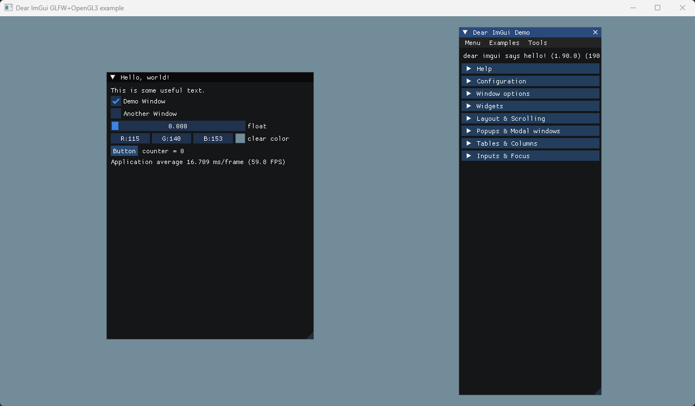

以绘制三角形为例，来熟悉 OpenGL API。

这部分内容，对于刚接触 OpenGL 来讲，有难度的。要做的是不断地去查阅资料，来搞清楚每个函数的作用。

主要参考：[LearnOpenGL - 你好，三角形](https://learnopengl-cn.github.io/01%20Getting%20started/04%20Hello%20Triangle/)

主要知识点：

* glad 库的接入
* 硬件层渲染管线
* 缓存对象：VBO、EBO/IBO、VAO
* 着色器程序、顶点着色器、片元着色器

### GLAD 库的使用

引入 glad 主要是因为 OpenGL 驱动版本很多，大多数函数的位置都无法在编译时确定下来，所以需要在运行时查询。

GLAD就是一个库，能在运行时查找OpenGL的函数地址，这个找到的函数地址用一个函数指针存起来，供我们使用。因此我们所说的OpenGL API，在这种情况下，就是GLAD用函数指针封装好了的。简单来说，就是我们想要用OpenGL，就需要通过GLAD来从显卡驱动中取出函数来给我们用

下载 glad 时需要提供 opengl 的版本，当前使用 3.3，相应的 glsl 版本为 330

引入会导致一些与 ImGui 的冲突，因为 ImGui 中也包含了这样的操作。这点可以参考 [SheeEngine(8) —— GLAD 和 IMGUI - 知乎 - Hier.soan](https://zhuanlan.zhihu.com/p/549861908)

**解决方案就是将在项目的预处理器中加上 GLFW_INCLUDE_NONE**

还有注意 include目录以及在main中初始化 glad

### OpenGL渲染管线


### 缓冲对象以及相关函数

一个缓冲对象要经过3步处理，以顶点缓冲对象为例：
```c++
    unsigned int VBO;
    glGenBuffer(1,&VBO);
    glBindBuffer(GL_ARRAY_BUFFER,VBO)；
    glBufferData(GL_ARRAY_BUFFER, sizeof(vertices), vertices, GL_STATIC_DRAW);
```

glGenBuffers(GLsizei n,GLuint * buffers), 表示生成一个缓冲对象，此时只是个 Handle，可以理解为空对象

glBindBuffer(GLenum target,GLuint buffer)，第一个参数是缓冲区类型，表示后续所有对于 target 的操作，都是针对这个对象的，比如例子中的 VBO，此时只是设置了 OpenGL 的状态，还是没有内存操作的

glBufferData(GLenum target, GLsizeiptr size, const void *data, GLenum usage)，在显存里申请一块内存，并使用内存中的data数据去初始化该显存，也就是拷贝了一份。

对于 glBufferData 可能存在的疑问：
* 这个显存申请意味着什么，也就是OpenGL中的显存管理，其实内容很多，glBufferData 只是其中一个函数，其他的可以去查阅其他资料。
* 这个显存申请并拷贝数据是异步的吗？是的，这个跟 OpenGL 的客户端服务端模式有关。这个在红宝书中也有说明

VAO理解：虽然全称为顶点数组缓冲，但是实际功能类似配置对象。


<br>

**运行结果：**



