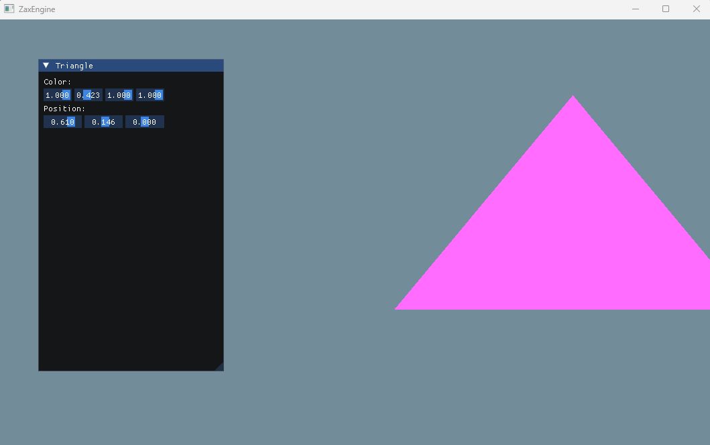

以绘制三角形为例，来熟悉 OpenGL API。

主要参考：[LearnOpenGL - 着色器](https://learnopengl-cn.github.io/01%20Getting%20started/05%20Shaders/)

这部分内容，对于刚接触 OpenGL 来讲，有难度的。这里同时也对参考文章里的一些内容进行了扩充。

主要知识点：

* Shader 和 GLSL
* 顶点的多属性布局
* Shader的管理
* 光栅化的原理（应该是最重要的内容了，但是新手可能一次不能全部理解。可以通过软光栅化代码去理解光栅化，这个在参考文章里没提，但其实很重要）

### Shader 和 GLSL 

OpenGL 使用的 Shader 语言为 GLSL。

对于本版本的Shader，需要掌握如下内容：
* layout，顶点属性的布局，对应 glVertexAttribPointer，通过这个才能访问到显存里的顶点属性
* in/out，主要用于着色器之间的数据传递
* uniform，保存在显存中的全局数据，无论 vertext shader 还是 fragment shader 都可以访问此数据。
* 内置变量，比如本版本片元着色器中的 FragColor
* 内置函数

关于内置变量和内置函数，很多文章都有的，可以自己总结一下。 
容易出错的地方还是版本问题，不同版本的内置变量和函数是有变化的，总结的时候留意一下。

### 光栅化

光栅化过程主要解决2个问题：
1. 一个三角形覆盖哪些像素，决定哪些像素进入片元着色阶段
2. 顶点数据的插值，比如颜色，法线

对于第1点，就是利用三角函数，求某点是否在三角形内还是三角形外。
对于第2点，插值，是重心坐标插值。本质上是面积比。

对于法线插值，这个到后面接触法线就知道了。

### 其他问题

编码问题：VS 默认文件编码已经是 UTF-8 with BOM 的了，并不是很多文章说的那么乱

调试及字符串问题：因为没有控制台显示，所以想在VS的输出窗口中显示调试信息。需要用到 OutputDebugString 函数，此函数只接受宽字符串，所以这里需要转换以下。

C++ 编译错误的输出信息太晦涩，范围太广。比如 error C4430: 缺少类型说明符 - 假定为 int。注意: C++ 不支持默认 int。实际上是因为把 using namespace std 放在了 cpp 文件，而不是头文件里

**运行结果：**

