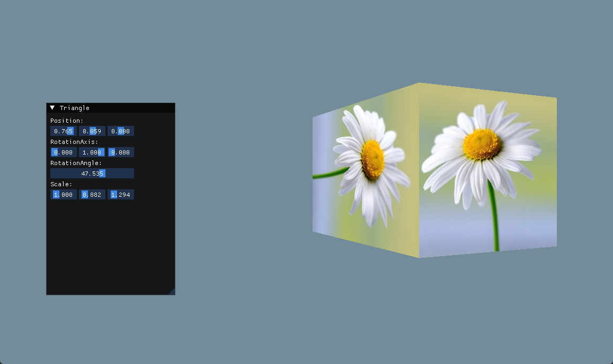

## 绘制立方体

主要知识点：

* 向量，矩阵
* 坐标空间变换
* 透视除法与NDC
* 深度测试

这一版本最难理解的，就是矩阵变换的推导，但是闫神给出了非常清晰的推导思路，直接去看Games101课程就可以了。

### 向量，矩阵

主要是矩阵的运算法则。

矩阵的乘法有结合律，但是没有交换律

一般来说，矩阵和向量的乘法，会把向量当作列向量。

这里有一个视频可以让你初次理解矩阵的空间变换：[bilibili - 线性代数的本质 - 矩阵与线性变换](https://www.bilibili.com/video/av6731067?p=4)

矩阵与向量的乘法的运算逻辑，有2种思路：
* 基向量的变换，就是视频中的变换。这个可以帮助你理解为什么矩阵可以进行空间变换
* 直接运用矩阵的运算规则

基向量变换运算规则如下，不过这种方式并不适合快速运算，所以在真正进行矩阵乘法时，还是用矩阵的正常的运算规则比较好。

**无论如何，记住，矩阵没什么特别的，只是一个数学工具。（比如为什么矩阵运算是这样子的，就跟为什么1+1=2一样，只当成工具就可以）**

求位移和旋转的矩阵运是有点绕的：
* 位移矩阵，为了完成位移，需要将三维向量扩展成四维向量，增加的一维称为齐次坐标。为什么要扩展，因为矩阵作为线性变换，是无法改变空间原点的，只能通过更大一维的运算才能完成仿射变换
* 旋转矩阵，这个需要利用三角函数进行推导，可以从二维旋转矩阵入手去理解。一般数学库都提供了提供旋转角度来获得矩阵的函数。

关于旋转函数的推导，只要理解了思路了，其实不难，一定不要怵，我刚开始就只是觉得好像很复杂，就以为很难。其实推导过程要比直接看结果要更清晰。 
基本思路跟二维差不多的，理解二维旋转，基本理解了三维旋转的一半了，另一半是旋转轴和该向量的三角关系（这个有点绕，但还是三角函数的推导），推导的核心是向量在旋转轴上的垂直分量和平行分量。可以参考：[三维空间绕任意轴旋转矩阵的推导](https://zhuanlan.zhihu.com/p/56587491)

### 坐标空间变换

矩阵用于坐标空间变换，尤其是投影矩阵，绝对是可以劝退新手的。

对于 MVP 变换的推导，直接看闫神的课程，比其他的课程都要清晰。

投影矩阵另外有个关键点，是对 Z 轴的处理。在闫神的课程里，Z 轴的处理是线性的，但是，由于为了进行深度测试，需要近平面的精度更高，也就是非线性处理。具体做法可以参考其他文章。

### 透视除法与NDC

在经过投影矩阵的转换后的坐标，实际上是齐次坐标，甚至可以理解为膨胀的坐标。那么透视除法，就是坐标除以ω值，将其还原到三维下的NDC空间。

齐次坐标需要跟透视投影一起去理解。

### 其他问题

本版本的立方体，不采用索引缓冲（EBO） 
因为对于3维的，如果要用EBO，那么顶点数据只会有8个点，那么按照之前的纹理方式，是没法处理纹理坐标的，而是需要进行纹理的 uv 展开。但是现在并没有uv坐标，只有纹理的st坐标。所以暂时只用顶点缓冲。关于uv这部分内容以后会说。

在生成纹理时，会以4个字节为单位读取图片资源。 
当原始图片资源的像素大小不是4个字节(比如RGB，没有A)，或者大小是4个字节，但是长宽又不是4个字节，那么，就导致读取错乱，出现扭曲问题。 
解决方案是设置OpenGL读取的单位长度为1。glPixelStorei(GL_UNPACK_ALIGNMENT, 1);

**运行结果：**

