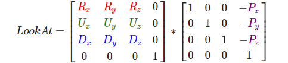
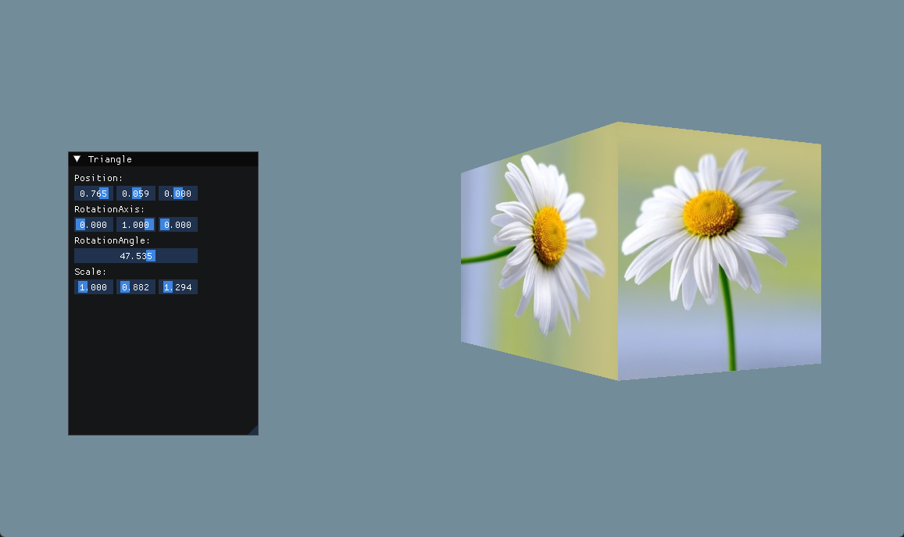

## 设置摄像机,进行场景浏览

操作：WASD 移动，鼠标移动进行相机旋转

版本内容：
* 观察矩阵与LookAt矩阵
* 欧拉角

观察矩阵，这个看闫神的推导视频就懂了。推导的关键点就是旋转矩阵是正交矩阵，所以矩阵的转置等于逆，可以进行反推。

LookAt 矩阵，其实就是观察矩阵，只是起了个名叫 LookAt，并且找到了些规律，可以直接通过三向量凑出观察矩阵。

欧拉角，由于欧拉角旋转的顺序会导致不同的旋转结果，所以我们与Untiy相似的顺规，基于本地坐标系的 yxz 顺序，也即 yaw -> pitch -> roll

一个 LookAt 矩阵的构成如下：

R，表示摄像机的右向量 
U，表示摄像机的上向量  
D，表示摄像机的前向量 
P，表示摄像机的位置

构造矩阵时需要注意的是：

第1点，对于3个向量，其实只需要2个就够了，比如说前向和上向，那么右向可以通过叉乘求出

第2点，本章摄像机没有 roll 的改变，所以，对于上向量的选取，可以直接选取**世界的单位的Up向量(0,1,0)**。那么，你可能会想，不对呀，假设有 pitch 的旋转，上向量不等同于世界的呀。所以说，流程改为，先确定相机的前向，然后跟世界的Up叉乘，确定右向，最后，再用这个相机前向和相机的右向量，求出真正的上向量，这里虽然稍微绕一点，但是用手比划一下也就理解了。这样，我们只需要求出前向，那么，另外2个也就确定了。

关于前向的确定，就是三角函数运算，这个可以看 LearnOpenGL 中的计算。

编码里的细节：

* yaw 值默认初始化为 -90f, 因为 yaw 是围绕 y 轴旋转的，当 yaw 为 0 时，结果是跟 x 轴正向对齐的，而我们想默认方向为 -z，就需要逆时针旋转90度。

关于 yaw/pitch/roll 方向的正负问题，yaw，向右偏航为正，pitch，向上俯仰为正，roll，向右翻滚为正

**运行结果：**

