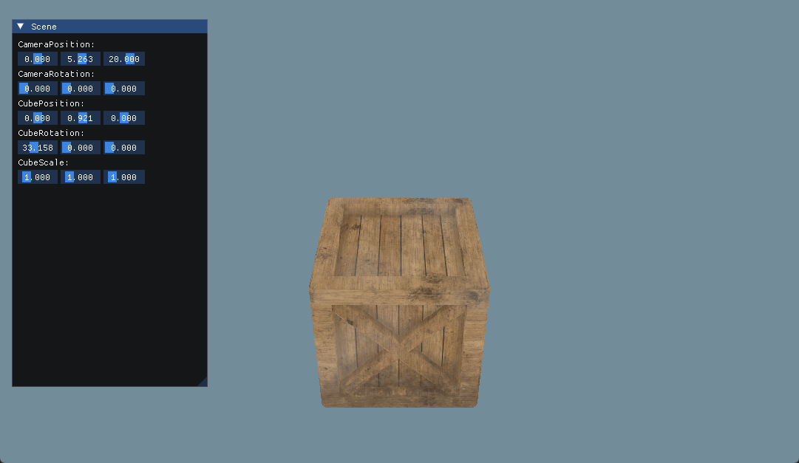

## 导入模型，并显示

主要内容：
* Assimp 资源导入库的编译与接入
* obj 和 mtl 文件格式的理解
* Assimp 加载 obj 和 mtl 文件
* 规范旋转逻辑

### 资源导入库 assimp 编译与接入

github 下载源码，然后使用 cmake 先 make 一下，会在当前目录下生成 vs 工程 Assimp.sln

打开工程，直接编译生成，会在当前目录生成 bin 目录和 lib 目录，内部分别保存 lib 文件和 dll 文件，因为 Assimp 项目生成的是带lib的动态链接库，所以这两个文件都要加入到项目。

lib 就加入到依赖库目录，而 dll 需要先放在项目任意目录下，然后在 vs 的生成后事件中，将 dll 拷贝到执行文件相同的目录下。

事件命令行如下：xcopy /y /d "..\\..\\Plugins\assimp\assimp-vc143-mtd.dll" "$(OutDir)"

### obj 和 mtl 文件格式的理解

在 obj 文件中，可以存在对于以 o 开头的多个物体，obj 文件同时可以关联材质库 mtl，mtl 材质库，其中存在材质名称，参数，以及关联的纹理坐标。

### Assimp 加载模型并显示

选择 obj 格式，是因为 obj 是可以用文本直接打开，能够比较直观的看到文件的构成。
mtl，材质库文件，内部包含多个材质，每个材质的参数都写在里面。

Assimp 加载 obj 文件时，该 obj 如果关联一个 mtl 文件，那么，会自动加载这个文件，除非此文件不存在，如果不存在也不会报错。

因为目前项目还没有资源管理器，所以对于加载的 mesh/material/texture，都放在一个 Model 中来表示。

因为材质的特殊性，我们可能希望这个模型，并不直接使用内部的材质属性，所以，这里我们分三步操作，最终进行物体渲染：

1. 生成 AssetModel 对象，仅仅是对加载后物体的一个包装，以方便后面获取相应的数据
2. 生成 MeshRenderer, 需要 Transform/Mesh/Material，在构造函数中，会与 OpenGL 通信，将数据生成并传送给 OpenGL
3. 在循环中调用 MeshRenderer.Draw()，Draw 函数会进行 Uniform 等数据的传输和纹理的绑定

### 规范旋转逻辑

对于旋转，我们选用欧拉旋转。不止针对于物体，也针对于摄像机位置，同时，后面会创建单独的Transform组件。 
首先，我们规定，根据本地坐标系，依次进行 yaw/pitch/roll 的旋转，对应我们的坐标轴，为 y/x/z 
其次，我们得规定哪个方向是正负，比如说，进行 yaw 旋转，是朝右还是朝左才是正，这里有2个方案，Unity 是以左右手为准，握住旋转轴，大拇指指向该选择轴的正向，其余四指的方向为正（这里注意Unity为左手坐标系，别搞错了），而 Unreal 中以常规的姿态朝右朝上为正。这两种方案都是可以的。 
那么，在这里我们采用 Unity 方案。

对于和摄像机相关的观察矩阵，需要再次处理一下，对于上一个版本，我们使用了一个LookAt矩阵，但是 glm::lookAt 函数，默认的 front 是对齐 x轴，这也是为什么 yaw 值初始为 -90 的原因（这个地方我思考了挺长时间的）。同时，又因为我们的roll值不变，所以直接用了世界坐标的 up，这几个条件都是我们不想要的。

所以，我们现在需要一个正常的观察矩阵。根据闫神的说法，观察矩阵可以看作从原点到该摄像机的变换矩阵的反向，同时，变换矩阵可以拆分为旋转矩阵和位移矩阵，位移矩阵的反向很好求，就是位置的反向，旋转矩阵，利用他的正交性质，可以很容易得到逆矩阵就等于转置，也可以得到逆矩阵，这样就求出了观察矩阵。也即 ViewMatrix = M的转置 * T的反向。

**运行结果：**

