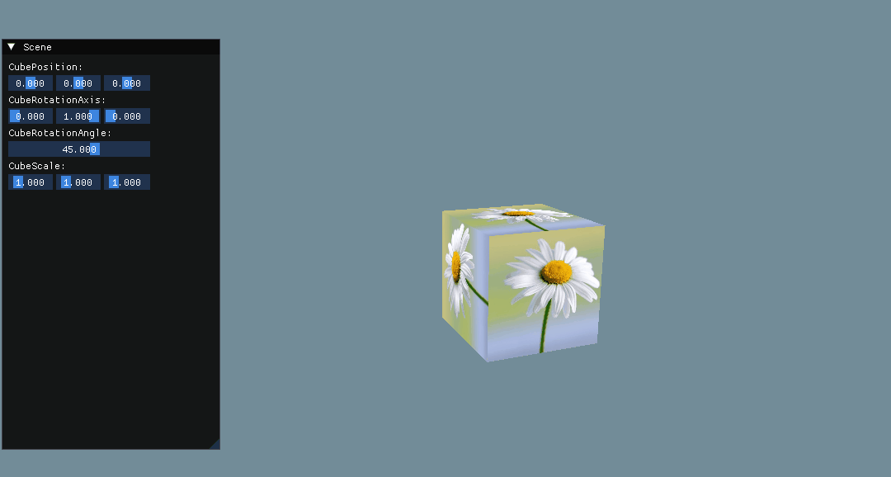

## 导入模型，并显示

主要内容：
* Assimp 资源导入库的编译与接入
* obj 和 mtl 文件格式的理解
* Assimp 加载 obj 和 mtl 文件

### 资源导入库 assimp 编译与接入

github 下载源码，然后使用 cmake 先 make 一下，会在当前目录下生成 vs 工程 Assimp.sln

打开工程，直接编译生成，会在当前目录生成 bin 目录和 lib 目录，内部分别保存 lib 文件和 dll 文件，因为 Assimp 项目生成的是带lib的动态链接库，所以这两个文件都要加入到项目。

lib 就加入到依赖库目录，而 dll 需要先放在项目任意目录下，然后在 vs 的生成后事件中，将 dll 拷贝到执行文件相同的目录下。

事件命令行如下：xcopy /y /d "..\\..\\Plugins\assimp\assimp-vc143-mtd.dll" "$(OutDir)"

### Assimp 加载模型

选择 obj 格式，是因为 obj 是可以用文本直接打开，能够比较直观的看到文件的构成。
mtl，材质库文件，内部包含多个材质，每个材质的参数都写在里面。

Assimp 加载 obj 文件时，该 obj 如果关联一个 mtl 文件，那么，会自动加载这个文件，除非此文件不存在，如果不存在也不会报错。

**运行结果：**

