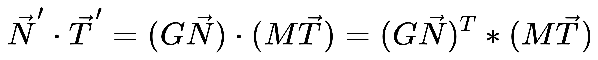

## 为场景添加 blinn-phong 光照

主要内容：
1. blinn-phong 光照的实现
2. 光照所需要的基本参数的贴图

### blinn-phong 光照模型的实现

为什么人眼可以看到颜色，是因为人眼对电磁波的强度和波长的刺激不同，就产生了不同的信号。光是一种电磁波，我们能看到物体的颜色，是因为物体吸收了光波的一部分，无法被吸收的，就会被反射进入人眼。 
也就是说，我们看到的是经过物体反射后剩余的光。

可以简单的定义一个光源，假设为（1,1,1），而顶点反射假设为（0.2,0.3,0.4）,这两者分量相乘，就可以简单的表示该顶点对于该光源的反射结果。 
所以说，对于模型的表面的基础色纹理，其实就是表面对于每种波长电磁波的反射率。这个概念比较重要，因为可以让你理解纹理表面记录的是什么。

blinn-phong光照有3个项构成：
* lambert 漫反射
* specular 高光
* ambient 环境光

blinn phong 是对 phong 模型的高光项优化，由视线和反射光线的夹角，调整为法线和半程向量的夹角。

此光照模型是经验模型，没有严格的数学建模。在之后，会接触基于微表面的基于物理模型。

高光值，使用 pow 指数函数包裹，使其可以集中在一个中心区域。

### 需要注意的问题

法线问题：

**1.模型的不等比缩放，导致法线结果不再保持之前的关系**

无论这个顶点法线，是不是经过了建模软件的法线平滑，都是存在这个问题的。比如，当前版本的立方体，对其进行y方向的scale增加，那么会法线有些地方的亮度是不正确了。

目标就是推导出一个法线矩阵，让这个法线去跟这个矩阵计算出结果。 
推导不难，挺有意思的，推导核心是满足下面的式子： 

其中，G 为法线矩阵，M 为模型矩阵，N 为法线，T 为垂直于法线的两个顶点的差向量。（不一定非要垂直，因为法线是存在平滑的，只需要点乘的结果是个常量）

最后结果是，法线矩阵，等于模型矩阵的逆再转置。

由于法线矩阵需要先求逆，这个过程在 shader 中运算比较费，尽量放到CPU中，提前计算出来。

**2.法线在光栅插值后需要进行归一化**

**运行结果：**

