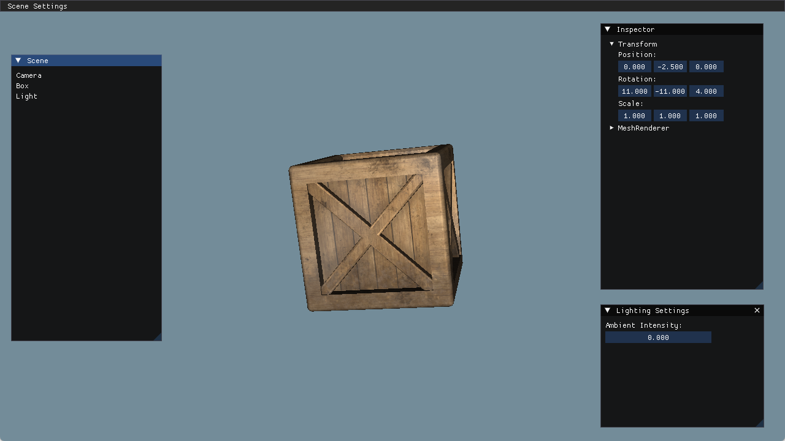

## 为场景添加 blinn-phone 光照

主要内容：
1. blinn-phone 光照的实现
2. 光照所需要的基本参数的贴图

### blinn-phone 光照模型的实现

为什么人眼可以看到颜色，是因为人眼对电磁波的强度和波长的刺激不同，就产生了不同的信号。光是一种电磁波，我们能看到物体的颜色，是因为物体吸收了光波的一部分，无法被吸收的，就会被反射进入人眼。 
也就是说，我们看到的是经过物体反射后剩余的光。

可以简单的定义一个光源，假设为（1,1,1），而顶点反射假设为（0.2,0.3,0.4）,这两者分量相乘，就可以简单的表示该顶点对于该光源的反射结果。 
所以说，对于模型的表面的基础色纹理，其实就是表面对于每种波长电磁波的反射率。这个概念比较重要，因为可以让你理解纹理表面记录的是什么。

blinn-phone光照有3个项构成：
* lambert 漫反射
* specular 高光
* ambient 环境光

blinn phone 是对 phone 模型的高光项优化。

此光照模型是经验模型，没有严格的数学建模。

### 注意问题

1.法线缩放问题

**运行结果：**

